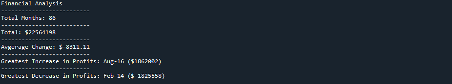

# python-challenge

Solution scripts for the python challenges provided at the UC Berkeley Data Analytics Bootcamp.

PyBank
Python script for analyzing the financial records of a company. Given two sets of revenue data (budget_data_1.csv and budget_data_2.csv). Each dataset is composed of two columns: Date and Revenue.

Created a Python script that analyzes the records to calculate each of the following:

The total number of months included in the dataset

The total amount of revenue gained over the entire period

The average change in revenue between months over the entire period

The greatest increase in revenue (date and amount) over the entire period

The greatest decrease in revenue (date and amount) over the entire period

Results:

PyPoll
Python script for helping a small, rural town modernize its vote-counting process.

Given two sets of poll data (election_data_1.csv and election_data_2.csv). Each dataset is composed of three columns: Voter ID, County, and Candidate.

Created a Python script that analyzes the votes and calculates each of the following:

The total number of votes cast

A complete list of candidates who received votes

The percentage of votes each candidate won

The total number of votes each candidate won

The winner of the election based on popular vote.

Results:

